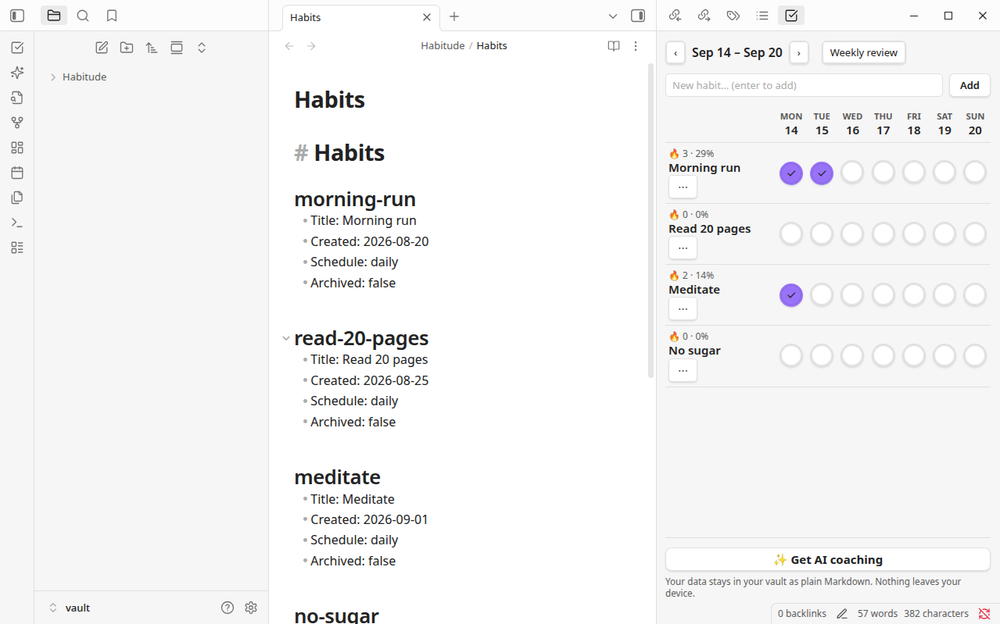
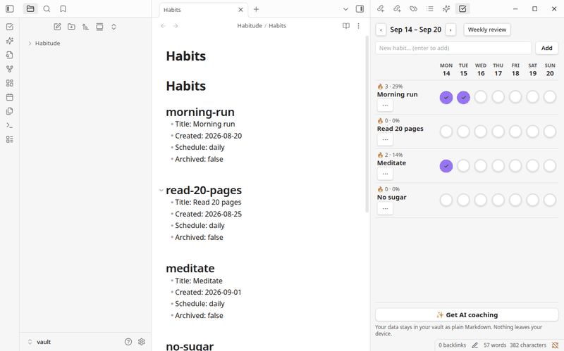
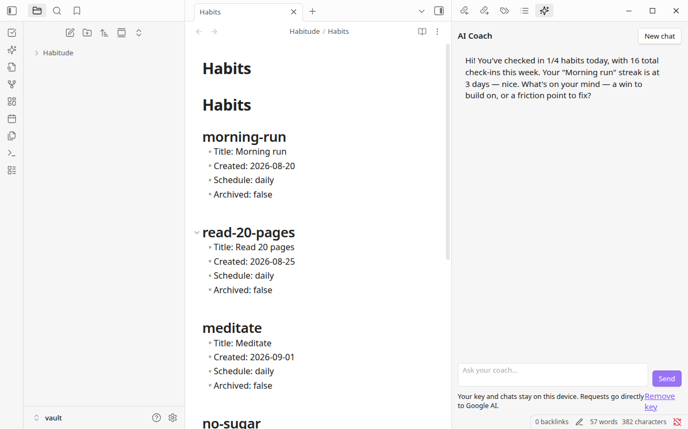

# Habitude Checklist — Obsidian Plugin

A 7-day habit checklist for Obsidian: add habits, tap days to check them off, track streaks and weekly completion rates, and open a weekly review. Markdown-native — your data lives in your vault as plain markdown.

## Screenshots



*The 7-day checklist grid next to your plain-Markdown habit data. Click a cell to toggle — streaks and weekly rates update live:*





*The AI coach greets you with your own stats and chats about your habits — free with your own Gemini API key (BYOK).*

## Data layout (in your vault)

Under the configured data folder (default `Habitude/`):

```
Habitude/
  Habits.md            # habit registry, one "## <id>" section per habit
  Log/
    2026-09-15.md      # daily log: "- [x] morning-run <!-- Morning run -->"
```

Both files are human-readable and hand-editable. The plugin re-reads them on every render (and on vault `modify` events), so edits you make directly in the notes are picked up automatically.

## Features

- **Checklist view** (ribbon icon, or command *Open checklist*): habits × 7-day grid, click a cell to toggle. Week navigation (‹ ›), per-habit streak (🔥) and weekly %.
- **Add habits** inline; **archive** via the ⋯ menu next to the habit name.
- **Weekly review** (command *Open weekly review* or the button in the view): per-habit completion bars, total checks.
- **Command** *Toggle today for a habit*: quick toggle from the command palette.
- **Status bar**: today's progress (`✓ 3/5 today`).
- **AI coach** (ribbon icon, or command *Open AI coach*): chat with a coach that knows your habits — your streaks, weekly rates, and weekday patterns are shared with the model automatically as statistics. Free with your own Gemini API key (BYOK).
  - See it in action: [coach greeting](#screenshots) · [checklist demo](assets/demo.gif)
- **Settings** (`Settings → Habitude checklist`): data folder, week start day (Mon/Sun), optional Gemini API key, coach model, coach language.
- **Get AI coaching** footer button: opens `https://habitude.ai` in your browser.

## Privacy

- **Checklist: fully local.** Habit tracking never calls any API, opens no connections, and holds no credentials. Your habits live in your vault as plain Markdown.
- **AI coach: opt-in BYOK.** The coach only activates if you paste your own Gemini API key (free from Google AI Studio). The key is stored only on this device, and requests go **directly to Google AI** — never to Habitude servers. Each message carries your habit *statistics* (streaks, rates, patterns), never your raw note text.
- The only other thing that ever leaves Obsidian is you: the *Get AI coaching* button opens `https://habitude.ai` in your browser.

## Development

```bash
npm install
npm run dev      # watch mode
npm run build    # production: tsc + esbuild → main.js
```

Manual test install: copy `main.js`, `manifest.json`, `styles.css` into `<Vault>/.obsidian/plugins/habitude-checklist/`, reload Obsidian, enable under **Settings → Community plugins**.

## Funnel

See [FUNNEL.md](./FUNNEL.md) for how this plugin fits the Habitude acquisition funnel (Stage 0 wedge → connect → digital twin → premium).
